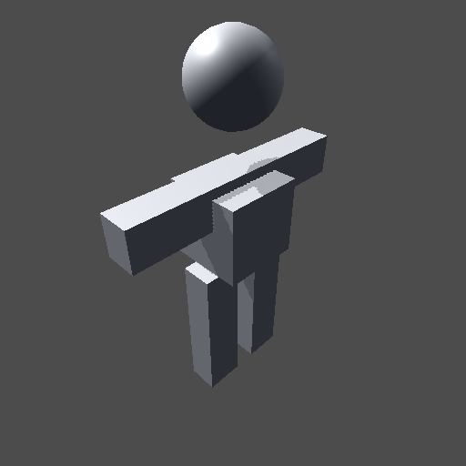
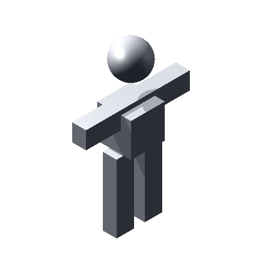

# Runtime Preview Generator for Unity 3D

**Available on Asset Store:** https://www.assetstore.unity3d.com/en/#!/content/112860

**Forum Thread:** https://forum.unity.com/threads/runtime-preview-thumbnail-generator-open-source.500194/

This script lets you generate thumbnails for your **GameObject's** or **materials** in **Texture2D** format while the game is running. There are 2 main functions:

```csharp
public static Texture2D GenerateMaterialPreview( Material material, PrimitiveType previewObject, int width = 64, int height = 64 );
public static Texture2D GenerateModelPreview( Transform model, int width = 64, int height = 64, bool shouldCloneModel = false );
```

**RuntimePreviewGenerator.GenerateMaterialPreview** function generates thumbnail for a *material* using a primitive object whereas **RuntimePreviewGenerator.GenerateModelPreview** function generates thumbnail for a *GameObject* (can be either a prefab or a scene object).

The **width** and **height** parameters define the size of the thumbnail texture. To guarantee a clear shot from the model in *GenerateModelPreview* function, the model is moved far away from the origin of the world (if it is not static) and then returned to its original position after the thumbnail is generated (this effect won't be visible to any scene cameras). If **shouldCloneModel** parameter in *GenerateModelPreview* function is set to *true*, the model is instantiated (cloned) and the clone is used to create the thumbnail texture. This parameter is automatically set to *true* for prefabs. Unless you absolutely do not want your scene object to be moved, keep it as *false* for increased performance.

There are also 2 variants for these functions that use **replacement shaders** while rendering the thumbnails (see: https://docs.unity3d.com/Manual/SL-ShaderReplacement.html). These functions are:

```csharp
public static Texture2D GenerateMaterialPreviewWithShader( Material material, PrimitiveType previewPrimitive, Shader shader, string replacementTag, int width = 64, int height = 64 );
public static Texture2D GenerateModelPreviewWithShader( Transform model, Shader shader, string replacementTag, int width = 64, int height = 64, bool shouldCloneModel = false );
```

There are a few options to customize the generated thumbnails:

- **RuntimePreviewGenerator.PreviewRenderCamera**: lets you use your own camera for rendering the thumbnails instead of an internal camera that is automatically generated by *RuntimePreviewGenerator*. This is useful when you want to render thumbnails with some post-processing effects applied. You can set it to **null** to continue using the internal camera. Its default value is *null*
- **RuntimePreviewGenerator.PreviewDirection**: the direction that the camera will face relative to the previewed object's forward axis. So, a value of *Vector3(0,0,-1)* will create thumbnails from directly in front of the previewed object whereas a value of *Vector3(0,0,1)* will create thumbnails from the rear of the previewed object. Its default value is *Vector3(-1,-1,-1)*
- **RuntimePreviewGenerator.Padding**: additional % padding applied to the edges of the thumbnail texture. The accepted value range is (-0.25,0.25). Enter a negative value if there is too much space at the edges of the thumbnails by default. Its default value is *0*
- **RuntimePreviewGenerator.BackgroundColor**: background color of the thumbnail texture. Its default value is *Color(0.3,0.3,0.3,1)*
- **RuntimePreviewGenerator.OrthographicMode**: determines whether orthographic projection (*true*) or perspective projection (*false*) will be used while rendering the thumbnails. Although its default value is *false*, make note that thumbnails rendered with orthographic projection usually fill more pixels and are more center-aligned when compared to perspective projection
- **RuntimePreviewGenerator.TransparentBackground**: renders thumbnails with completely transparent background. It increases the size of the thumbnail textures as they now use alpha channel, as well. Its default value is *false*

Please note that procedurally generated textures are not automatically garbage collected, so you have to call **Destroy(thumbnailTexture)** or **DestroyImmediate(thumbnailTexture)** after you no longer need a thumbnail. Though, be aware that unused procedural textures do get garbage collected while changing scenes, so even if you don't destroy the thumbnails manually, they won't consume memory forever. But it is always better to destroy the thumbnails manually when you know that you won't be needing them anymore.

Here are two example thumbnails, one with perspective projection and grey background and the other with orthographic projection and transparent background:




**DEBUG_BOUNDS Mode**: the location of the preview render camera is calculated using the Renderer bounds of the target object. If you want, you can uncomment the first line of the *RuntimePreviewGenerator* script to see the corners of the bounds in the thumbnail textures

**NOTE:** If you receive a `UnityException: Texture '' is not readable, the texture memory can not be accessed from scripts.` error while trying to manipulate the generated textures, change the `result.Apply( false, true );` line as following: `result.Apply( false, false );`

Well, that's it, I guess. Enjoy!
